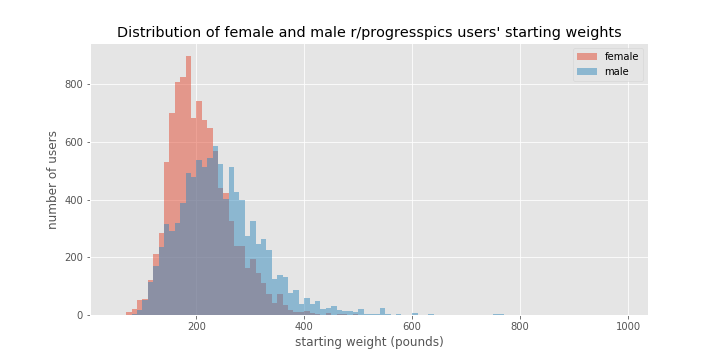

# /r/progresspics project - MVP

### Goals

r/progresspics is an active subreddit where people post before and after pictures that typically document weight loss.  Here is a summary of the characteristics of people who post to r/progresspics.

### Data Cleaning

r/progresspics recommends that Redditors title their submission in a particular format that includes sex, age, height, starting weight, ending weight and the time duration of the weight change.

###### Format:
Gender/Age/Height \[Weight Before > Weight After = Total amount lost\](Time period in months) Personal Title

###### Sample Entry:
"M/26/6'0 \[190lbs&gt;175lbs=15lbs loss\] (-2.5 years). All natural hard work."

 From Google's BigQuery, the title, author, timestamp, score, and the number of comments for all 27,464 posts made to r/progresspics in 2018 was downloaded, then a custom script was used to extract the relevant information from the title of each post.  Despite many formatting irregularities the sex, age, height_in, start_weight, and end_weight was extracted from the titles of 20,065 posts.  Since many users did not include the duration of the weight change (period_months) that information was only available for 12,517 posts.  Several other features were derived including the difference between ending and starting weight (weight_diff), if the post included a "Not Safe for Work" tag (NSFW), the number of times the post author posted to the subreddit in 2018 (num_posts), the rate of weight loss (rate), and the normalized rate of weight loss (norm_rate). Finally, from the timestamp, multiple date descriptors including the month and day of the week (dayofweek) were extracted.

### Initial Data Exploration

#### Sex

r/progresspics users are 48% male and 52% female.

#### Age

The average age of an r/progresspics user is 26.1 years and that is consistent for both males (26.1 years) and females (26.2 years). The youngest and oldest users in 2018 were 10 years old and 68 years old respectively.  The majority of users (66.8%) are in their 20s.

#### Height and weight

The height ranges of the male and female r/progresspics users appear normally distributed with an average male height of 70.9 inches (~ 5'11'') and an average female height of 65.3 inches (~5'5'').

The distributions of the average starting weights for male and female r/progresspics users were shaped differently with the female starting weights forming a tighter peak then the male starting weights.  Both distributions had tails extending towards higher weights.  The average starting male weight was 243.2 lbs and the average starting female weight was 206.7 lbs.

The male and female ending weight distributions were more similarly shaped.  The average male final weight was 195.2 lbs and the average female final weight was 163.4 lbs.

####  Pounds lost and gained

People use r/progresspics to report their efforts at both losing and gaining weight.  In this data set, 18083 users (90%) reported weight loss, 1778 users (9%) reported weight gain, while 204 (1%) reported no weight change.  The average male loser lost 61.9 lbs and the average female loser lost 46.0 lbs, while the average male gainer gained 28.2 lbs and the average female gainer gained 19.7 lbs. The largest weight loss reported by a male was 500 lbs and the largest weight loss for a female was 316 lbs.

#### Duration of weight loss

The length of time over which weight loss occurred could be determined for 12,517 r/progresspics users.  The max period of weight loss reported was 16 years, but most of the users (98.4%) reported the duration of weight loss to be 6 or fewer years and within that group, a majority (67.4%) indicated the weight loss time frame was one year or less.  The histogram below shows the weight loss duration for users whose weight loss occurred over 6 years or less.  Spikes are visible at 12, 24, 36, 48, and 60 months indicating that users like to post to r/progress_pics on yearly anniversaries of the beginning of their weight loss journey.

#### Rate of weight loss

The raw rate of weight loss was determined by dividing the amount of weight loss by the duration of the weight-loss period.  Overall r/progresspics users, the raw rate of weight loss was 5.8 lbs/month with men losing weight at an average rate of  6.6 lbs/month and women at 5.1 lbs/month.  The weight loss rate distribution shown below confirms that men lose weight at a high rate.

#### Previous work

A similar analysis was previously undertaken by Medium user acedb on a smaller dataset of ~700 posts and their results can be found [here][ec6949e2].

  [ec6949e2]: https://medium.com/@acedb/what-is-being-posted-on-r-progresspics-an-initial-analysis-351e43b5d7c4 "r/progesspics analysis"
