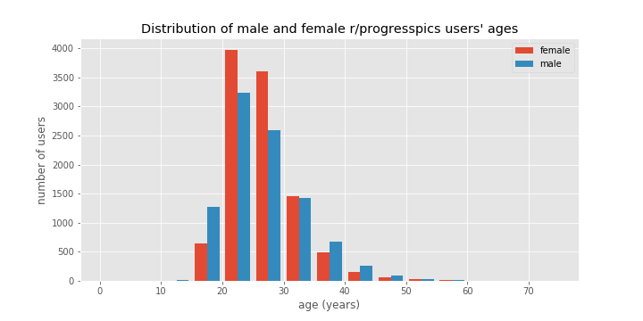
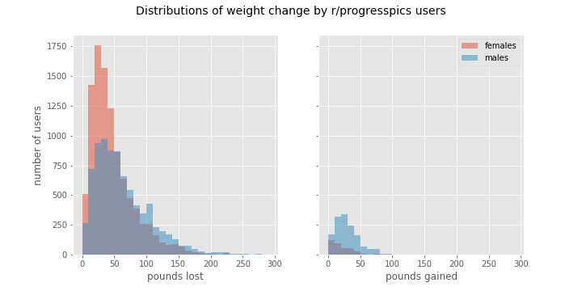

# /r/progresspics project

### Goals

r/progresspics is an active subreddit where people post before and after pictures that typically document weight loss.  Here is a summary of the characteristics of people who post to r/progresspics as well as a preliminary effort to see if there are any connections between the characteristics of the Redditor who posted and the amount of weight loss and/or the popularity of their posts.

### Data Cleaning

r/progresspics recommends that Redditors title their submission in a particular format that includes sex, age, height, starting weight, ending weight and the time duration of the weight change.

###### Format:
Gender/Age/Height \[Weight Before > Weight After = Total amount lost\](Time period in months) Personal Title

###### Sample Entry:
"M/26/6'0 \[190lbs&gt;175lbs=15lbs loss\] (-2.5 years). All natural hard work."

 From Google's BigQuery, the title, author, timestamp, score, and the number of comments for all 27,464 posts made to r/progresspics in 2018 was downloaded, then a custom script was used to extract the relevant information from the title of each post.  Despite many formatting irregularities the sex, age, height_in, start_weight, and end_weight was extracted from the titles of 20,065 posts.  Since many users did not include the duration of the weight change (period_months) that information was only available for 12,517 posts.  Several other features were derived including the difference between ending and starting weight (weight_diff), if the post included a "Not Safe for Work" tag (NSFW), the number of times the post author posted to the subreddit in 2018 (num_posts), the rate of weight loss (rate), and the normalized rate of weight loss (norm_rate). Finally, from the timestamp, multiple date descriptors including the month and day of the week (dayofweek) were extracted.

### Initial Data Exploration

#### Sex

r/progresspics users are 48% male and 52% female.

During my initial exploration, I looked at the sex and age of the r/progresspics users and compared these demographics to those of the whole Reddit user population and the general adult US population (https://www.techjunkie.com/demographics-reddit/).  This is an imperfect comparison since Reddit is used by people worldwide, not just those residing in the US.

While Reddit users, in general, are more likely to be male, the percentage of male and female r/progresspics users more closely matched the US general population indicating that r/progresspics users skew more female than the general Reddit population.

#### Age

The average age of an r/progresspics user is 26.1 years and that is consistent for both males (26.1 years) and females (26.2 years). The youngest and oldest users in 2018 were 10 years old and 68 years old respectively.  The majority of users (66.8%) are in their 20s.

Reddit users tend to be younger than the general US adult population and r/progresspics users follow that same trend.

#### Height and weight

The height ranges of the male and female r/progresspics users appear normally distributed with an average male height of 70.9 inches (~ 5'11'') and an average female height of 65.3 inches (~5'5'').

The distributions of the average starting weights for male and female r/progresspics users were differently shaped with the female starting weights forming a tighter peak then the males.  Both distributions had tails extending towards higher weights.  The average starting male weight was 243.2 lbs and the average starting female weight was 206.7 lbs.

The male and female ending weight distributions were more similarly shaped.  The average male ending weight was 195.2 lbs and the average female ending weight is 163.4 lbs.

####  Pounds lost and gained

People use r/progresspics to report their efforts at both losing and gaining weight.  In this data set, 18083 users (90%) reported weight loss, 1778 users (9%) reported weight gain, while 204 (1%) reported no weight change.  The average male loser lost 61.9 lbs and the average female loser lost 46.0 lbs, while the average male gainer gained 28.2 lbs and the average female gainer gained 19.7 lbs. The largest weight loss reported by a male was 500 lbs and the largest weight loss for a female was 316 lbs.

#### Duration of weight loss

The length of time over which weight loss occurred could be determined for 12,517 r/progresspics users.  The max period of weight loss reported was 16 years, but most of the users (98.4%) reported the duration of weight loss to be 6 or fewer years and a majority (67.4%) indicated the weight loss time frame was one year or less.  The histogram below shows the weight loss duration for users whose weight loss occurred over 6 years or less.  Spikes are visible at 12, 24, 36, 48, and 60 months indicating that users prefer to post to r/progresspics on the anniversary of the beginning of their weight loss journey.

#### Rate of weight loss

The raw rate of weight loss was determined by dividing the amount of weight loss by the duration of the weight-loss period.  Overall r/progresspics users, the raw rate of weight loss was 5.8 lbs/month with men losing weight at an average rate of  6.6 lbs/month and women at 5.1 lbs/month.  The weight loss rate distribution shown below confirms that men lose weight at a faster rate than women.

### Regression analyses

#### Weight loss
I first looked to see if there was a simple linear relationship between the weight loss of an r/progresspics user and any of the following features using the larger dataset lacking: age, sex, height_in, start_weight, and end_weight.  Variables that describe the post to r/progresspics not considered since they are factors unrelated to the weight loss process. Since the focus is weight loss, the datasets used in these regression analyses were filtered to only contain posts where the weight_diff was > 0. While all the features had significant p-values (<0.05), only one feature (start_weight) had a large R2 value (0.56).  The remainder were below 0.05.  I then repeated the analysis using the smaller dataset that included the additional weight change duration variables (period_months and rate).  Again all the features had p-values below (0.05) and starting_weight had the largest R2 value (0.56).  The next largest was the rate at 0.12.

Since starting weight, based on R2 values, looks like the best feature in our dataset to explain the variation in weight loss, diagnostic plots were run to see if this model fulfills the assumptions of a simple linear regression model.

While the regression plot shows that there is a linear relationship between the amount of weight loss and the starting weight, the residuals vs fit plot shows a fanning effect indicating heteroskedasticity and non-constant error variance.  The probability plot shows that the residuals have a heavy tailed, normal distribution.

Next, multiple linear regression analyses were used to see if there were any combinations of features could explain the variation in weight loss better than start_weight alone.  For these analyses, the end_weight variable was removed since when combined with start_weight, a 100% accurate model was generated.  This is an expected outcome as the dependent variable, weight_diff is calculated by subtracting end_weight from start_weight.

Combining the various features using the best subsets and forward stepwise procedures produced multiple linear regression models with modestly higher R2-adjusted values than start_weight alone. For the larger dataset, including height_in raised the R2-adjusted from 0.56 to 0.58.  For the smaller duration data set, the best R2-adjusted value was achieved with a model that contained all 5 variables, but as it was only 0.055 above start_weight alone, the simple start_weight only model still seems like the best option.

The observation that a linear regression model explaining weight_diff using the variables period_months and rate did not have an R2-adjusted approaching 1.0 points to a problem with the dataset.  The most likely issue is the period_months variable.  The method used to extract period_months from the post title focused on finding units of time (weeks, months, years) in the title and using the number before the time unit to then calculate the period_months. However, people often included a unit of time in reference to things besides how long they have been changing their weight ie how long they have been going to the gym, how long they have been on a keto diet, etc.  In the future, a better algorithm to extract period_months will be developed.

Delete(Finally, the start_weight and weight_diff variables were transformed in various ways to see if the model could be improved.  For example, repeating the analysis using the log of start_weight improved the normality plot, but it lowered the R2 value and did not improve the residuals vs fitted values plot.)

#### r/progresspics post popularity

The popularity of a Reddit post can be approximated by its score, which is the number of upvotes a post received minus the number of downvotes, or by the number of comments (num_comments) left.  Though r/progresspics is primarily an image-driven forum, I was curious if any of the demographic information pulled from the title could be used to predict the popularity of a particular post.  However, after doing both single and multiple linear regressions as well as various feature transformations, I was unable to identify any single feature or combination of features that made a meaningful contribution to the variation seen in either the score or the number of comments.  Though most features had significant p_values, they did not meet model conditions required to trust a linear regression result since there was either no linear relationship or the residual errors were either not independent, not normally distributed, or did not have equal variance.

The failure of this linear regression analysis is likely due to either a lack of a linear relationship between the dependent and independent variables and/or that the feature set did not contain any pertinent dependent variables.  Though future analysis may produce different results, the current conclusion is that simple identifiers like sex, age, or amount of weight loss do not have a linear correlation to the popularity of a post.

### Previous work

 Medium user acedb analyzed a smaller dataset of ~700 posts and their results can be found [here][ec6949e2].

  [ec6949e2]: https://medium.com/@acedb/what-is-being-posted-on-r-progresspics-an-initial-analysis-351e43b5d7c4 "r/progesspics analysis"

  ### Future work
  - Apply more sophisticated models to attempt to identify a relationship between the 'title' features and weight loss and/or post popularity.
  - Redo extraction of the period_months feature and check the results
  - Extract features related to the pictures contained in each post to use in future modeling efforts.
  - Download and process additional years of progress_pics data to see if the characteristics of the users have changed over time.  These datasets could also be used to validate future predictive models.
  - Analyze the comments associated with each post.  Often the user who made the post will provide details of their weight change protocol in the comments.  These comments could be identified and analyzed using natural language processing algorithms to gain insights into the techniques used during successful weight loss or gain.  Seeing how these techniques change over time would also be of interest.
